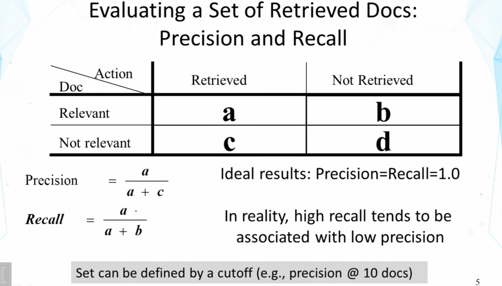
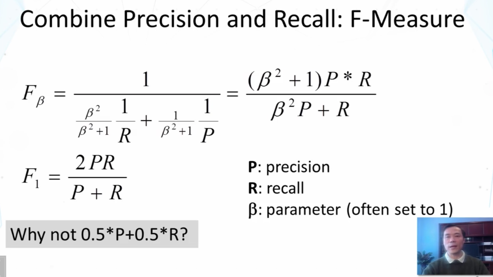
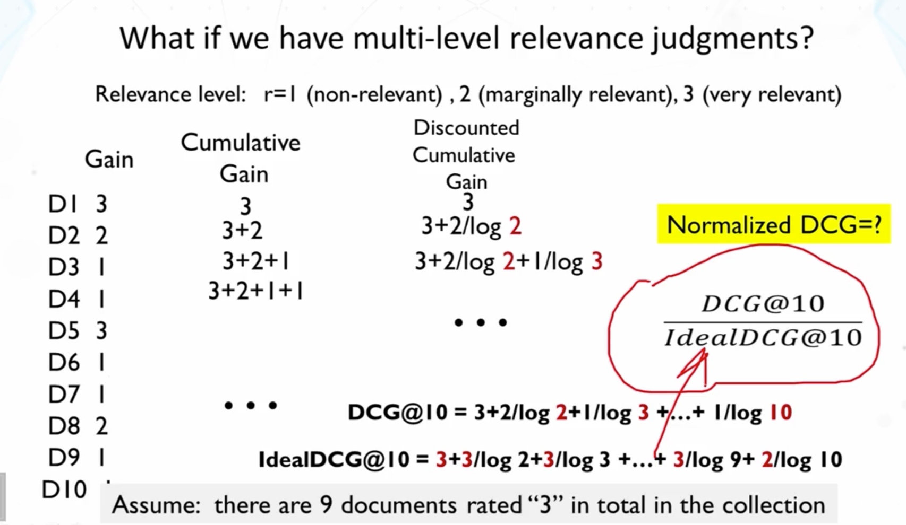
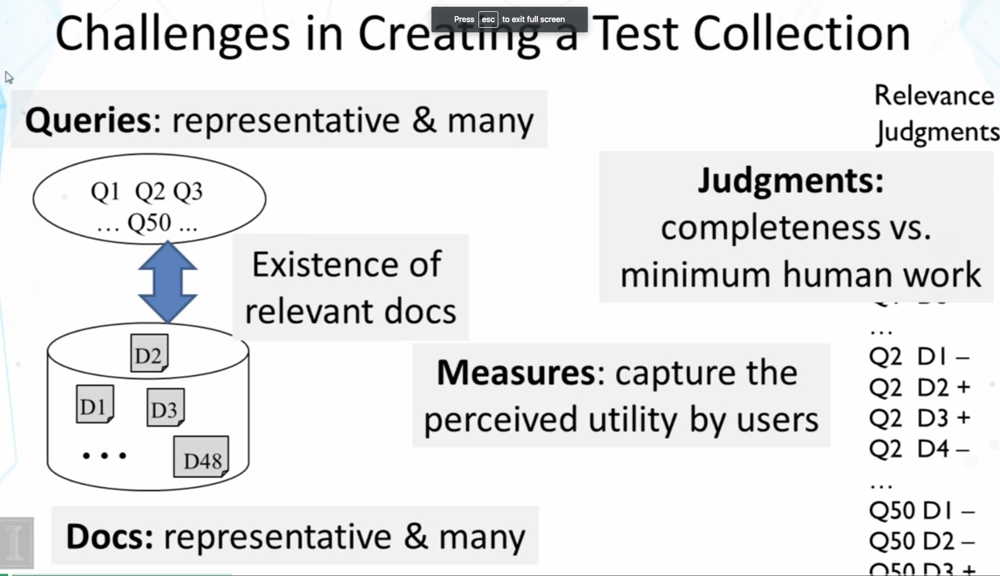
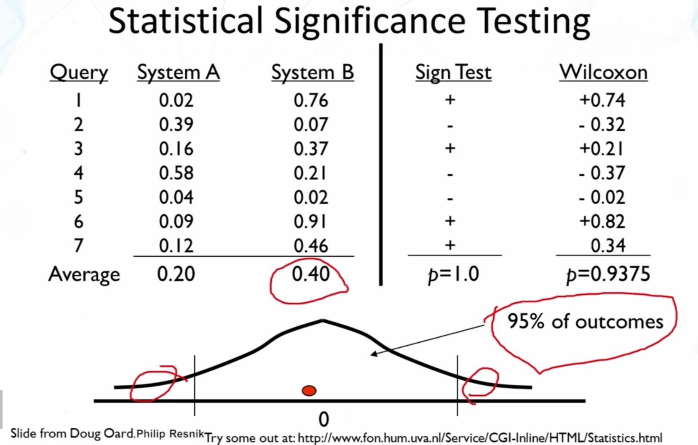

[toc]
# Evaluation of TR Systems
**Why Evaluation?**

- Reason 1: Assess the actual utility of a TR system 
    - Measures should reflect the utility to users in a real application
    - Usually done through user studies (interactive IR evaluation)
- Reason 2: Compare different systems and methods
    - Measures only need to be correlated with the utility to actual users, thus don't have to accurately reflect the exact utility to users
    - Usually done through test collections (test set IR evaluation)

**What to Measure?**

- Effectiveness/Accuracy: how accurate are the search results?
    - Measuring a system's ability of ranking relevant documents on top of non-relevant ones
-  Efficiency: how quickly can a user get the results? How much computing resources are needed to answer a query?
    - Measuring space and time overhead
- Usability: How useful is the system for real user tasks?
    - Doing
    - user studies

## Basic Measures

Not balance when a value is too high

## Evaluating Ranked Lists

Precision-Recall (PR) Curve
### Mean Average Precision(MAP)

- Average Precision
    - The average of precision at every cutoff where a new relevant document is retrieved
    - Normalizer = the total # of relevant docs in collection
    - Sensitive to the rank of each relevant document
- Mean Average Precisions (MAP)
    - MAP = arithmetic mean of average precision over a set of queries
    - gMAP = geometric mean of average precision over a set of queries
    - Which is better?
        - In arithmetic mean, the sum is dominating by large values, gMAP tends to be affected more by low values
        - difficult queries(gMAP)

### Special Case: Mean Reciprocal Rank
- When there's only one relevant document in the collection (e.g., known item search)
    - Average Precision = Reciprocal Rank = 1/r, where r is rank position of the single relevant doc
    - Mean Average Precision -> Mean Reciprocal Rank
    - Why not simply using r?
        - To reduce the influence by large values
### Summary
- Precision-Recall curve characterizes the overall accuracy of a ranked list
- The actual utility of a ranked list depends on how many top-ranked results a user would examine
- Average Precision is the standard measure for comparing two ranking methods
    - Combines precision and recall
    - Sensitive to the rank of every relevant document

## Multi-Level Judgements

r = relevance level, use **Discounted Cumulative Gain**, r / log POS
$Normalized\ DCG = \frac{DCG@10}{IdealDCG@10}$

**Normalized Discounted Cumulative Gain(nDCG)**

- Applicable to multi-level judgments in a scale of [1,r], r>2
- Main idea of nDCG@k documents
    - Measure the total utility of the top k documents to a user
    - Utility of a lowly ranked document is discounted
    - Normalized to ensure comparability across queries

## Practical Issues

### Statistical Significance Testing

### Pooling: Avoid Judging all Documents
- If we can't afford judging all the documents in the collection, which subset should we judge?
- Pooling strategy
    - Choose a diverse set of ranking methods (TR systems)
    - Have each to return top-K documents
    - Combine all the top-K sets to form a pool for human assessors to judge
    - Other (unjudged) documents are usually assumed to be non-relevant (though they don't have to)
    - Okay for comparing systems that contributed to the pool, but problematic for evaluating new systems

## Summary of TR Evaluation
- Extremely important!
    - TR is an empirically defined problem
    - Inappropriate experiment design misguides research and applications
    - Make sure to get it right for your research or application
- Cranfield evaluation methodology is the main paradigm
    - MAP and nDCG: appropriate for comparing ranking algorithms
    - Precision@10docs is easier to interpret form a user's perspective
- Not covered
    - A-B Test
    - User studies

