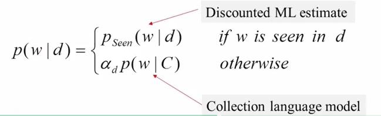

# Probabilistic Retrieval Model
## Basic Idea
### Many Different Retrieval Models
- Probabilistic models: $f(d,q) = p(R=1|d,q), \quad R\in \{0,1\}$
    - Classic probabilistic model -> BM25
    - **Language model -> Query Likilihood**
    - Divergence-from-randomness model -> PL2

$$ p(R=1|d,q) \approx p(q|d,R=1)$$

> Means if a user likes document d, how likely would the user enter query q (in order to retrieval d)?
> 
> Assumption: A user formulates a query based on an "**imaginary relevant document**"

### Summary
- Relevance(q,d) = $ p(R=1|d,q) \to p(q|d,R=1)$
- **Query likelihood** ranking function: f(q,d) = p(q|,d)
    - Probability that a user who likes d would pose query q
- How to compute p(q|d)? How to compute probability of text in general? -> **Language Model**

## Statistical Language Model

### Why is a LM Useful?
- Quantify the uncertainties in natural language
- Allows us to answer questions like:
    - Given that we see "John" and "feels", how likely will we see "happy" as opposed to "habit" as the next word? (**speech recognition**)
    - Given that we observe "baseball" three times and "game" once in a news article, how likely is about "sports"?(**text categorization, information retrieval**)
    - Given that a user is interested in sports news, how likely would the user use "baseball" in a query?(**information retrieval**)
### The Simplest language Model: Unigram LM
    - Generate text by generating each word INDEPENDENTLY
    - Thus, $p(w_1 w_2 ... w_3)=p(w_1)p(w_2)...p(w_n)$
    - Parameters: {p(w_i)} and the sum is 1
    - Text = sample drawn according to this word distribution

### Summary
- Language Model = probability distribution over text
- Unigram Language Model = word distribution
- Use of a Language Model
    - Representing topics
    - Discovering word associations

## Query Likelihood Retrieval Function
Query Generation by Sampling Words from Doc

 

**Improved Model: Sampling Words from a Doc Model**

$$f(q, d) = \log p(q|d) = \sum_{w\in V} c(w,q)\log{p(w|d)}$$

## Statistical Language Model
Ranking Function based on Query Likelihood

### How to smooth a LM
**Key Question**: what probability should be assigned to an unseen word?

- Let the probability of an unseen word be proportional to its probability given by a reference LM
- One possibility: Reference LM = Collection LM

- Enable efficient computation

### Summary
- Smoothing of p(w|d) is necessary for query likelihood
- General idea: smoothing with p(w|C)
    - The probability of an unseen word in d is assumed to be proportional to p(w|C)
    - Leads to a general ranking formula for query likelihood with TF-IDF weighting and document length normalization
    - Scoring is primarily based on sum of weights on matched query terms
- However how exactly should we smooth?

## Smoothing Methods

### Linear Interpolation (Jelinek-Mercer) Smoothing

### Dirichlet Prior (Bayesian) Smoothing

### Summary
- Two smoothing methods
    - Jelinek-Mercer: Fixed coefficient linear interpolation
    - Dirichlet Prior: Adding pseudo counts; adaptive interpolation
- Both lead to state of the art retrieval functions with assumptions clearly articulated (less heuristic)
    - Also implementing TF-IDF weighting and doc length normalization
    - Has precisely one (smoothing) parameter

### Summary of Query Likelihood Probabilistic Model
- Effective ranking functions obtained using pure probabilistic modeling
    - Assumption 1: Relevance(q, d) = P(R=1|q, d) $$\approx P(q|d)$$ 
    - Assumption 2: Query words are generated independently
    - Assumption 3: Smoothing with p(w|C)
    - Assumption 4: JM or Dirichlet prior smoothing
- Less heuristic compared with VSM
- Many extensions have been made [Zhai 08]

