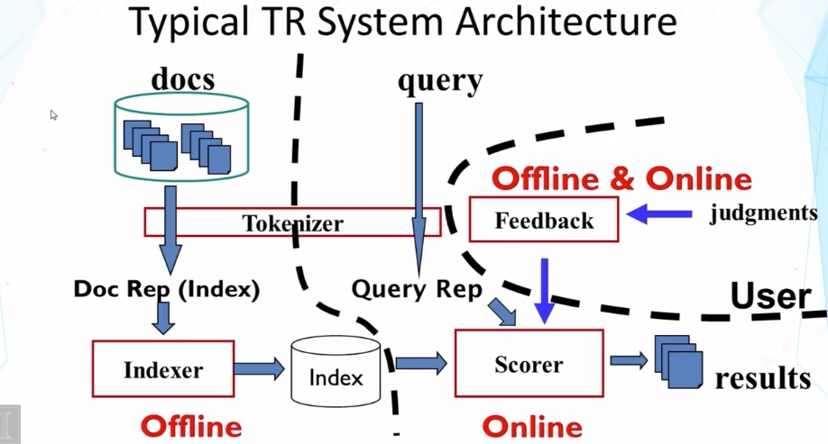
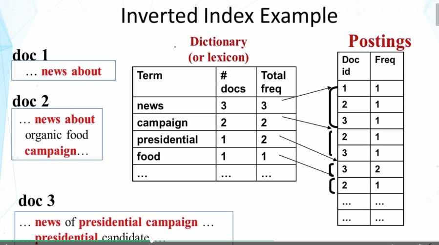

# System Implementation
 

## Tokenization

- Normalize lexical units: Words with similar meanings should be mapped to the same indexing term
- Stemming: Mapping all infectional forms of words to the same root form, e.g.
    - computer -> compute
    - computation -> compute
    - computing -> compute
- Some languages (e.g., Chinese) pose challenges in word segmentation

## Indexing

- Indexing = Convert documents to data structures that enable fast search(precomputing as much as we can)
- Inverted index is the dominating indexing method for supporting basic search algorithms
- Other indices (e.g., document index) may be needed for feedback 

### Inverted Index

**Empirical distribution of words**

- There are stable language-independent patterns in how people use natural languages
- A few words occur very frequently; but most words occur rarely
- The most frequent words in one corpus may be rare in another

**Zipf's Law**

- rank * frequency $$\approx$$ constant

**Data Structures for Inverted Index**

- Dictionary: modest size
    - Needs fast random access
    - Preferred to be in memory
    - Hash table, B-tree, trie, ...
- Postings: huge
    - Sequential access is expected
    - Can stay on disk
    - May contain docID, term freq., term pos, etc
    - Compression is desirable

