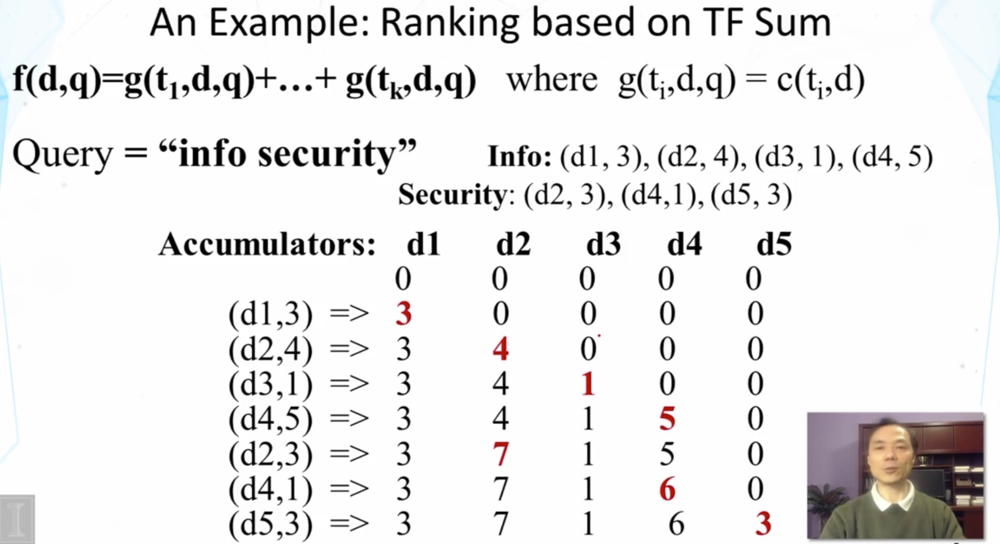

# System Implementation
 

## Tokenization

- Normalize lexical units: Words with similar meanings should be mapped to the same indexing term
- Stemming: Mapping all infectional forms of words to the same root form, e.g.
    - computer -> compute
    - computation -> compute
    - computing -> compute
- Some languages (e.g., Chinese) pose challenges in word segmentation

## Indexing

- Indexing = Convert documents to data structures that enable fast search(precomputing as much as we can)
- Inverted index is the dominating indexing method for supporting basic search algorithms
- Other indices (e.g., document index) may be needed for feedback 

### Inverted Index

**Empirical distribution of words**

- There are stable language-independent patterns in how people use natural languages
- A few words occur very frequently; but most words occur rarely
- The most frequent words in one corpus may be rare in another

**Zipf's Law**

- rank * frequency $$\approx$$ constant

**Data Structures for Inverted Index**

- Dictionary: modest size
    - Needs fast random access
    - Preferred to be in memory
    - Hash table, B-tree, trie, ...
- Postings: huge
    - Sequential access is expected
    - Can stay on disk
    - May contain docID, term freq., term pos, etc
    - Compression is desirable

## Inverted Index Construction

- The main difficulty is to build a huge index with limited memory
- Memory-based methods: not usable for large collections
- Sort-based methods:
    - Step 1: collect local (termID, docID, freq) tuples
    - Step 2: sort local tuples (to make "runs")
    - Step 3: pair-wise merge runs
    - Step 4: output inverted file

### Inverted Index Compression

- In general, leverage skewed distribution of values and use variable-length encoding
- TF compression
    - Small numbers tend to occur far more frequently than large numbers
    - Fewer bits for small (high frequency) integers at the cost of more bits for large integers
- Doc ID compression
    - "d-gap" (store difference): d1, d2-d1, d3-d2,...
    - Feasible due to sequential access
- Methods: Binary code, unary code, $\gamma$-code, $\delta$-code, ...
    - Binary: equal-length coding
    - Unary: x$\ge$1 is coded as x-1 one bits followed by 0, e.g., 3=>110; 5=>11110
    - $\gamma$-code: x => unary code for 1 + log(x) followed by uniform code for x-$2^{\log{x}}$ in log x bits, e.g., 3=>101, 5=>11001
    - $\delta$-code: same as $\gamma$-code, but replace the unary prefix with $\gamma$-code. E.g., 3=>1001, 5=>10101

### Uncompress Inverted Index

- Decoding of encoded integers
    - Unary decoding: count 1's until seeing a zero
    - $\gamma$-decoding
        - first decode the unary part; let value be k+1
        - read k more bits decode them as binary code; let value be r
        - the value of the encoded number is $2^k+r$
- Decode doc IDs encoded using d-gap
    - Let the encoded ID list be x1, x2, x3, ...
    - Decode x1 to obtain doc ID1; then decode x2 and add the recovered value to the doc ID1 just obtained
    - Repeatedly decode x3, x4, ..., add the recovered value to the previous doc ID.

## Implementation: Fast Search
  
**A General Algorithm for Ranking Documents**
$$f(q, d) = f_a(h(g(t_1, d, q), ..., g(t_k, d, q)), f_d(d), f_q(q))$$

- $f_d(d)$ and $f_q(q)$ are pre-computed
- Maintain a score accumulator for each d to compute h
- For each query term $t_i$
    - Fetch the inverted list {(d_1, f_1), ..., (d_n, f_n)} for each item in query
    - For each entry (d_j, f_j), compute **g(t_i, d_j, q)**, and update score accumulator for doc d_i to incrementally compute **h**
- Adjust the score to compute f_a, and sort

tips:
process the rare term first

### Further Improving Efficiency

- Caching (e.g., query results, list of inverted index)
- Keep only the most promising accumulators
- Scaling up to the Web-scale? (need parallel processing)

## Some Text Retrieval Toolkits

- Lucene (http://lucene.apache.org)
- Lemur/Indri (http://www.lemurproject.org)
- Terrier (http://terrier.org)
- MeTA (http://meta-toolkit.github.io/meta)
- More can be found at http://timan.cs.uiuc.edu/resources

## Summary

- Inverted index and its construction
    - Preprocess data as much as we can
    - Compression when appropriate
- Fast search using inverted index
    - Exploit inverted index to accumulate scores for documents matching a query term
    - Exploit Zipf's law to avoid touching many documents not matching any query term
    - Can support a wide range of ranking algorithms
- Great potential for further scaling up using distributed file system, parallel processing, and caching

