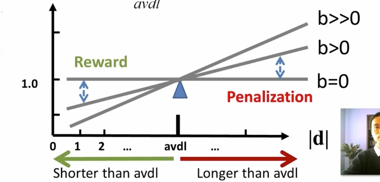

# Vector Space Model

- IDF Weighting: Penalizing Popular Terms
- $IDF(W) = \log[(M+1)/K]$ M: total number of docs in collection, k: total number of docs containing W
- Improved VSM
    - Dimension = word
    - Vector = TF=IDF weight vector
    - Similarity = dot product
    - Working better than the simplest VSM
    - Still having problems

## TF transformation
$f(q, d) = \sum_{w \in q \cup d}{c(w, q) c(w, d) \log{\frac{M+1}{df(w)}}}$

- M: Total # of docs in collection
- $$ \frac{M+1}{df(w)}$$: Doc Frequency

**Summary**

- Sublinear TF Transformation is needed to
    - capture the intuition of "diminishing return" form higher TF
    - avoid dominance by one single term over all others
- BM25 Transformation
    - has an upper bound
    - is robust and effective
- Ranking function with BM25 TF(k>=0)
$f(q, d) = \sum_{w \in q \cup d}{c(w, q) \frac{(k+1)c(w, d)}{c(w,d) + k} \log{\frac{M+1}{df(w)}}}$  

## Document Length Normalization

- Penalize a long doc with a doc length normalizer
    - Long doc has a better chance to match any query
    - Need to avoid over-penalization
- A document is long because
    - it uses more words -> more penalization
    - it has more contents -> less penalization
- Pivoted length normalizer: average doc length as "pivot"
    - Normalize = 1 if |d| = average doc length(avdl)
$normalizer = 1-b+b \frac{|d|}{avdl} \quad b \in [0,1]$

**State of the Art VSM Ranking Functions**

- Pivoted Length Normalization VSM [Singhal et al 96]
$f(q, d) = \sum_{w \in q \cup d}{c(w, q) \frac{\ln{[1 + \ln{[1 + c(w, d)]}]}}{1-b + b \frac{|d|}{avdl}} \log{\frac{M+1}{df(w)}}}$
- BM25/Okapi [Robertson & Walker 94]
$f(q, d) = \sum_{w \in q \cup d}{c(w, q) \frac{(k+1)c(w, d)}{c(w,d) + k(1-b+b \frac{|d|}{avdl})} \log{\frac{M+1}{df(w)}}}$

## Further Improvement of VSM

- Improved instantiation of dimension?
    - stemmed words, stop word removal, phrases, latent semantic indexing(word clusters), character n-grams,...
    - bag-of-words with phrases is often sufficient in practice
    - Language-specific and domain-specific tokenization is important to ensure "normalization of terms"
- Improved instantiation of similarity function?
    - cosine of angle between two vectors? 
    - Euclidean
    - __dot product__ seems still the best (sufficiently general especially with appropriate term weighting)
- Further Improvement of BM25
    - BM25F
        - Use BM25 for documents with structures ("F" = fields)
    - BM25+
        - Address the problem of over penalization of long documents by BM25 by adding a small constant to TF

## Summary of VSM

- Relevance(q, d) = similarity(q, d)
- Query and documents are represented as vectors
- Heuristic design of ranking function
- Major term weighting heuristics
    - TF weighting and transformation
    - IDF weighting
    - Document length normalization
- BM25 and Pivoted normalization seem to be most effective

